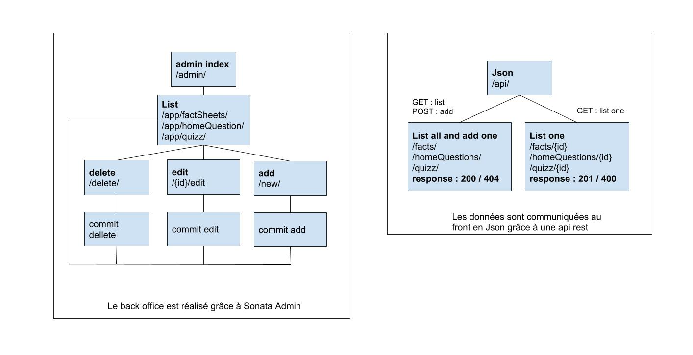

# Nebula

Nebula est un site qui regroupe les idées reçues que les films de SF véhiculent sur l’espace, à l’aide d’extrait de films, les articles auront pour but de contrer ses idées reçues en expliquant le pourquoi du comment. Grâce à un quiz les utilisateurs pourront tester leur culture générale concernant l’espace et, pourront consulter les fiches explicatives.

## Equipe:

* Federica Alfano
* Aymeline Chemin
* Clara de Langenhagen
* Enzo Hespel
* Laure Papin
* Corentin Croizat

## sitemap



## Page

```sql
CREATE TABLE `fact_sheets` (
  `id` int(11) NOT NULL AUTO_INCREMENT,
  `tab_title` varchar(110) COLLATE utf8mb4_unicode_ci NOT NULL,
  `category` varchar(60) COLLATE utf8mb4_unicode_ci NOT NULL,
  `main_title` varchar(60) COLLATE utf8mb4_unicode_ci NOT NULL,
  `video_description_title` varchar(60) COLLATE utf8mb4_unicode_ci NOT NULL,
  `video_description_text` varchar(3000) COLLATE utf8mb4_unicode_ci NOT NULL,
  `video_src` varchar(2048) COLLATE utf8mb4_unicode_ci NOT NULL,
  `video_alt` varchar(100) COLLATE utf8mb4_unicode_ci NOT NULL,
  `explanation_title` varchar(60) COLLATE utf8mb4_unicode_ci NOT NULL,
  `explanation_text` varchar(3000) COLLATE utf8mb4_unicode_ci NOT NULL,
  `scientific_fact_title` varchar(60) COLLATE utf8mb4_unicode_ci NOT NULL,
  `scientific_fact_text` varchar(3000) COLLATE utf8mb4_unicode_ci NOT NULL,
  PRIMARY KEY (`id`)
) ENGINE=InnoDB AUTO_INCREMENT=20 DEFAULT CHARSET=utf8mb4 COLLATE=utf8mb4_unicode_ci;
```
```sql
CREATE TABLE `home_questions` (
  `id` int(11) NOT NULL AUTO_INCREMENT,
  `page_id` int(11) NOT NULL,
  `question` varchar(160) COLLATE utf8mb4_unicode_ci NOT NULL,
  `answer` tinyint(1) DEFAULT NULL,
  PRIMARY KEY (`id`),
  UNIQUE KEY `UNIQ_F4082D91C4663E4` (`page_id`),
  CONSTRAINT `FK_F4082D91C4663E4` FOREIGN KEY (`page_id`) REFERENCES `fact_sheets` (`id`)
) ENGINE=InnoDB AUTO_INCREMENT=13 DEFAULT CHARSET=utf8mb4 COLLATE=utf8mb4_unicode_ci;
```
```sql
CREATE TABLE `quizz` (
  `id` int(11) NOT NULL AUTO_INCREMENT,
  `page_id` int(11) NOT NULL,
  `question` varchar(160) COLLATE utf8mb4_unicode_ci NOT NULL,
  `first_answer` varchar(110) COLLATE utf8mb4_unicode_ci NOT NULL,
  `first_answer_correction` tinyint(1) NOT NULL,
  `second_answer` varchar(110) COLLATE utf8mb4_unicode_ci NOT NULL,
  `second_answer_correction` tinyint(1) NOT NULL,
  `third_answer` varchar(110) COLLATE utf8mb4_unicode_ci NOT NULL,
  `third_answer_correction` tinyint(1) NOT NULL,
  PRIMARY KEY (`id`),
  UNIQUE KEY `UNIQ_7C77973DC4663E4` (`page_id`),
  CONSTRAINT `FK_7C77973DC4663E4` FOREIGN KEY (`page_id`) REFERENCES `fact_sheets` (`id`)
) ENGINE=InnoDB AUTO_INCREMENT=16 DEFAULT CHARSET=utf8mb4 COLLATE=utf8mb4_unicode_ci;
```

## Back office

### /api/

* facts
```
GET facts/
GET facts/{id}
POST facts/
```

```php
FactSheetsController::getFacts()
FactSheetsController::getOneFact()
FactSheetsController::PostFactsAction()
```

* homeQuestions
```
GET homeQuestions/
GET homeQuestions/{id}
POST homeQuestions/
```

```php
HomeQuestionsController::getQuestions()
HomeQuestionsController::getOneQuestion()
HomeQuestionsController::PostQuestionsAction()
```

* quizz
```
GET quizz/
GET quizz/{id}
POST quizz/
```

```php
QuizzController::getQuizz()
QuizzController::getOneQuizz()
QuizzController::PostQuizzAction()
```

### /admin/

SonataAdminBundle